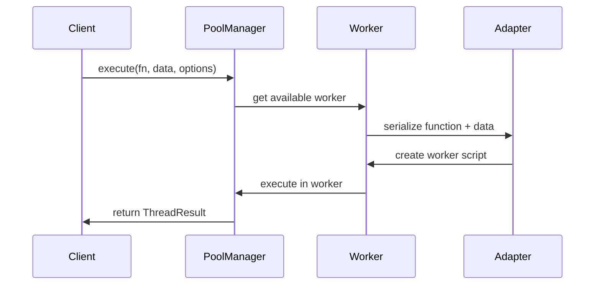

# 🏗️ ThreadJS Universal - Architektur

**Eine tiefgreifende Analyse der internen Architektur und Design-Prinzipien von ThreadJS Universal.**

## 📋 Übersicht

ThreadJS Universal basiert auf einem mehrschichtigen Architektur-Pattern, das **Plattform-Abstraktion**, **Pool-Management** und **intelligente Ressourcenverwaltung** kombiniert.

```bash
┌─────────────────────────────────────────────────────────────┐
│                    🎯 USER API LAYER                        │
│  threadjs.run() │ threadjs.parallel() │ threadjs.map()      │
└──────────────────┬──────────────────────────────────────────┘
                   │
┌─────────────────────────────────────────────────────────────┐
│                🧠 CORE ORCHESTRATION                        │
│         ThreadJS Singleton │ Task Queue Management          │
└──────────────────┬──────────────────────────────────────────┘
                   │
┌─────────────────────────────────────────────────────────────┐
│                🏊 WORKER POOL LAYER                         │
│    WorkerPoolManager │ Load Balancing │ Lifecycle Mgmt      │
└──────────────────┬──────────────────────────────────────────┘
                   │
┌─────────────────────────────────────────────────────────────┐
│              🔌 PLATFORM ABSTRACTION                        │
│   Browser │ Node.js │ Deno │ Bun Adapters                   │
└──────────────────┬──────────────────────────────────────────┘
                   │
┌─────────────────────────────────────────────────────────────┐
│               ⚙️ NATIVE WORKER LAYER                        │
│    Web Workers │ Worker Threads │ Platform-Specific         │
└─────────────────────────────────────────────────────────────┘
```

## 🎯 Design-Prinzipien

### 1. **Universal Compatibility**

- **Ein API für alle**: Identische API auf Browser, Node.js, Deno, Bun
- **Automatische Plattform-Erkennung**: Zur Laufzeit ohne Konfiguration
- **Graceful Degradation**: Fallback bei fehlender Worker-Unterstützung

### 2. **Performance First**

- **Sub-5ms Overhead**: Minimaler Performance-Impact
- **Intelligente Pool-Verwaltung**: Adaptive Skalierung basierend auf Load
- **Zero-Copy Operations**: Transferable Objects wo möglich

### 3. **Developer Experience**

- **One-Line API**: `await threadjs.run(fn, data)` für sofortige Parallelisierung
- **TypeScript-First**: Vollständige Type-Safety mit Generics
- **Intelligent Defaults**: Zero-Config mit unbegrenzter Anpassbarkeit

### 4. **Production Ready**

- **Circuit Breaker Pattern**: Fehlerhafte Worker automatisch isolieren
- **Memory Leak Prevention**: Automatische Ressourcenbereinigung
- **Graceful Shutdown**: Sauberer Ressourcen-Abbau

## 🧠 Core Components

### ThreadJS Singleton

**Zentrale Orchestrierung aller parallelen Operationen.**

```typescript
export class ThreadJS {
  private static instance: ThreadJS | null = null;
  private adapter: WorkerAdapter;
  private pool: PoolManager;
  private platform: Platform;

  // Singleton-Pattern für globale Konsistenz
  static getInstance(poolConfig?: PoolConfig): ThreadJS {
    if (!ThreadJS.instance) {
      ThreadJS.instance = new ThreadJS(poolConfig);
    }
    return ThreadJS.instance;
  }
}
```

**Verantwortlichkeiten:**

- ✅ Plattform-Erkennung und Adapter-Auswahl
- ✅ Pool-Instanziierung und -Konfiguration
- ✅ High-Level API-Bereitstellung
- ✅ Lifecycle Management

### WorkerPoolManager

**Intelligentes Pool-Management mit adaptiver Skalierung.**

```typescript
export class WorkerPoolManager implements PoolManager {
  private workers: WorkerInstance[] = [];
  private idleWorkers: WorkerInstance[] = [];
  private busyWorkers: Set<WorkerInstance> = new Set();
  private taskQueue: PoolTask[] = [];

  // LRU-basierte Worker-Verwaltung
  // Priority Queue für Task-Scheduling
  // Circuit Breaker für fehlerhafte Worker
}
```

**Algorithmen:**

- **Load Balancing**: Least-Busy-Strategie mit Round-Robin-Fallback
- **Adaptive Scaling**: CPU-basierte Worker-Anzahl-Optimierung
- **LRU Eviction**: Idle-Worker-Cleanup nach Timeout
- **Priority Queuing**: High/Normal/Low-Priority Task-Scheduling

### Platform Adapters

**Abstraktion plattformspezifischer Worker-Implementierungen.**

```bash
WorkerAdapter Interface
├── BrowserWorkerAdapter    → Web Workers + OffscreenCanvas
├── NodeWorkerAdapter       → Worker Threads + Cluster Mode
├── DenoWorkerAdapter       → Web Workers + Permissions
└── BunWorkerAdapter        → Optimized Worker Implementation
```

**Adapter Pattern Benefits:**

- 🎯 Einheitliche API trotz unterschiedlicher Worker-APIs
- 🔧 Plattformspezifische Optimierungen
- 🛡️ Isolierte Fehlerbehandlung
- 📈 Erweiterbarkeit für neue Plattformen

## 🔄 Execution Flow

### 1. **Task Submission**

```mermaid
graph TD
    A[threadjs.run(fn, data)] --> B[ThreadJS.getInstance()]
    B --> C[pool.execute()]
    C --> D[Queue Task with Priority]
    D --> E[Process Queue]
```

### 2. **Worker Selection**

```typescript
private async getAvailableWorker(): Promise<WorkerInstance | null> {
  // 1. Check idle workers (O(1))
  if (this.idleWorkers.length > 0) {
    return this.idleWorkers.shift()!;
  }

  // 2. Scale up if under max limit
  if (this.workers.length < this.config.maxWorkers) {
    return await this.createNewWorker();
  }

  // 3. Queue task if all workers busy
  return null;
}
```

### 3. **Task Execution**



### 4. **Resource Cleanup**

```typescript
private releaseWorker(worker: WorkerInstance): void {
  this.busyWorkers.delete(worker);

  if (!this.isTerminating && worker.isIdle()) {
    this.idleWorkers.push(worker);

    // Schedule idle cleanup
    setTimeout(() => {
      this.cleanupIdleWorker(worker);
    }, this.config.idleTimeout);
  }
}
```

## 🧪 Serialization System

### Function Serialization

**Herausforderung**: JavaScript-Funktionen können nicht nativ zwischen Worker-Contexten übertragen werden.

**Lösung**: String-basierte Serialisierung mit Scope-Isolation.

```typescript
export function serializeFunction(fn: Function): string {
  return `
    (function() {
      const userFunction = ${fn.toString()};
      return userFunction.apply(this, arguments);
    })
  `;
}
```

### Data Serialization

**Transferable Objects**: Für große Binärdaten (ArrayBuffer, ImageBitmap, etc.)

```typescript
export function hasTransferables(data: any): Transferable[] {
  const transferables: Transferable[] = [];

  if (data instanceof ArrayBuffer) {
    transferables.push(data);
  }
  // ... weitere Transferable-Typen

  return transferables;
}
```

### Worker Script Generation

```typescript
export function createWorkerScript(
  fn: Function,
  data: any,
  options: WorkerScriptOptions = {}
): string {
  return `
    // Self-contained worker script
    const userFunction = ${serializeFunction(fn)};
    const inputData = ${JSON.stringify(data)};

    // Execute and measure performance
    const startTime = performance.now();

    try {
      const result = userFunction(inputData);
      const executionTime = performance.now() - startTime;

      postMessage({
        result,
        executionTime,
        error: null
      });
    } catch (error) {
      postMessage({
        result: null,
        executionTime: 0,
        error: error.message
      });
    }
  `;
}
```

## 📊 Performance Optimizations

### 1. **Worker Pool Warm-up**

```typescript
private async initializeWorkers(): Promise<void> {
  // Pre-create minimum workers to avoid cold-start latency
  const workers = await Promise.all(
    Array(this.config.minWorkers)
      .fill(null)
      .map(() => this.adapter.createWorker(''))
  );

  this.workers.push(...workers);
  this.idleWorkers.push(...workers);
}
```

### 2. **Task Batching**

```typescript
async batch<T>(tasks: Task[], batchSize: number = 4): Promise<T[]> {
  const results: T[] = [];

  // Process in chunks to avoid memory spikes
  for (let i = 0; i < tasks.length; i += batchSize) {
    const batch = tasks.slice(i, i + batchSize);
    const batchResults = await this.parallel<T>(batch);
    results.push(...batchResults);
  }

  return results;
}
```

### 3. **Memory Management**

```typescript
private async cleanupIdleWorker(worker: WorkerInstance): Promise<void> {
  // Only cleanup if we have more than minimum workers
  if (this.workers.length > this.config.minWorkers && worker.isIdle()) {
    await this.adapter.terminateWorker(worker);
    this.removeWorkerFromPool(worker);
  }
}
```

## 🛡️ Error Handling & Resilience

### Circuit Breaker Pattern

```typescript
class WorkerCircuitBreaker {
  private failures = 0;
  private lastFailureTime = 0;
  private state: 'CLOSED' | 'OPEN' | 'HALF_OPEN' = 'CLOSED';

  canExecute(): boolean {
    if (this.state === 'OPEN') {
      // Check if we should attempt recovery
      if (Date.now() - this.lastFailureTime > this.resetTimeout) {
        this.state = 'HALF_OPEN';
        return true;
      }
      return false;
    }
    return true;
  }
}
```

### Graceful Degradation

```typescript
async run<T>(fn: Function, data?: any): Promise<T> {
  if (!supportsWorkerThreads()) {
    // Fallback to synchronous execution
    console.warn('Workers not supported, falling back to sync execution');
    return fn(data);
  }

  return await this.pool.execute<T>(fn, data);
}
```

## 🔄 Evolution Roadmap

### Phase 1: Foundation (✅ Complete)

- ✅ Universal Platform Support
- ✅ Core Pool Management
- ✅ Basic Performance Optimization

### Phase 2: Intelligence (🚧 In Progress)

- 🚧 ML-based Load Prediction
- 🚧 Adaptive Worker Scaling
- 🚧 Auto-optimization based on Usage Patterns

### Phase 3: Advanced Features (📋 Planned)

- 📋 WebAssembly Worker Hybrid Mode
- 📋 Edge Runtime Support (Cloudflare Workers, Vercel Edge)
- 📋 Quantum Computing Adapter

### Phase 4: Ecosystem (🔮 Vision)

- 🔮 Visual Debugging Tools
- 🔮 Performance Analytics Dashboard
- 🔮 Community Plugin System

---

**Diese Architektur ermöglicht es ThreadJS Universal, die de-facto Standard-Bibliothek für JavaScript-Parallelität zu werden - mit höchster Performance, universeller Kompatibilität und unvergleichlicher Developer Experience.**
